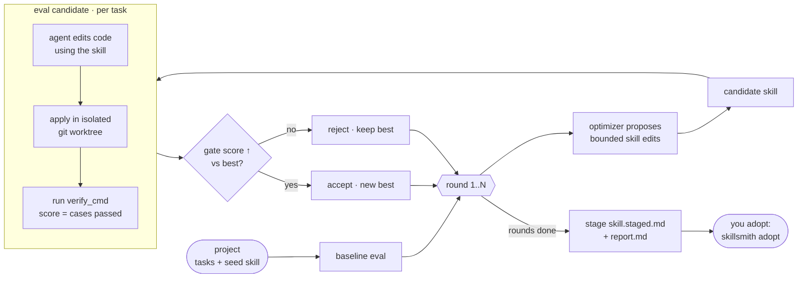

# skillsmith

*코딩 에이전트의 스킬을 실제 테스트를 기준으로 튜닝합니다 — LLM이 텍스트를 평가하는 것이 아니라 **테스트를 직접 실행**해서, 통과율을 실제로 높이는 편집만 채택합니다.*

[](LICENSE) [](https://www.rust-lang.org/) [](Cargo.toml) [](https://github.com/microsoft/SkillOpt)

> **API 키 불필요** — 기본 프로바이더는 설치된 `claude` CLI의 인증을 그대로 사용합니다.

## 개요

코딩 에이전트의 **스킬**은 컨벤션, 주의사항, 작업 방식 등을 담은 마크다운 지침서입니다. skillsmith는 이 문서를 최적화 대상으로 삼아, *실제로* 도움이 되지 않는 편집은 모두 거부합니다:

```
baseline → 스킬 편집 제안 → 재평가(테스트 실행) → 게이트(통과율 상승 시에만 채택) → 스테이징
```

모든 후보는 격리된 `git worktree` 안에서 **레포 자체 테스트**(`verify_cmd`)를 실행해 채점합니다. 점수는 단순 pass/fail이 아닌 **통과한 테스트 케이스의 비율**로, 옵티마이저가 실제 기울기를 따라 오릅니다. 라이브 파일은 아무것도 바뀌지 않으며, 개선된 스킬은 직접 adopt하기 전까지 *staged* 상태로 대기합니다.

- **벤치마크가 아닌 내 코드로 측정.** 보상 기준은 내 `verify_cmd` — 정답 문자열 비교도, LLM이 산문을 평가하는 것도 아닙니다.
- **속일 수 없는 게이트.** 테스트 스위트는 자신감 있는 문장에 흔들리지 않습니다. 편집은 실행 결과가 더 낫다고 할 때만 채택됩니다.
- **암기가 아닌 일반화 (선택).** 검증 태스크를 held-out으로 두면, 채택된 편집이 본 케이스를 *외운* 게 아니라 실제로 *전이*되어야 합니다.
- **설정 없이 로컬 실행.** `cargo install` 후 어디서든 실행, 데모 자동 시드, **API 키 불필요**. 모든 후보는 임시 `git worktree`에서 실행됩니다.

## 에이전트가 실제로 받는 것

스킬 하나만으로는 에이전트에게 무엇을 작성할지 알려줄 수 없습니다. `config.toml`의 각 태스크에는 **`intent`**(구체적인 코딩 지시)와 **`context_files`**(편집 대상 파일의 현재 상태)가 함께 있습니다. 에이전트는 이 세 가지를 동시에 받습니다:

```
skill.md          → 프로젝트 컨벤션 ("₩ 접두사 사용, 소수점 없음")
intent            → 구체적인 태스크  ("money.py에 format_amount() 구현")
context_files     → 현재 파일 스텁  (NotImplementedError 플레이스홀더)
```

에이전트는 `<<<FILE: path>>> … <<<END>>>` 블록으로 응답하고, skillsmith는 이를 격리된 `git worktree`에 적용한 뒤 `verify_cmd`를 실행합니다. 예측이 아니라 **실제 실행**입니다.

**`intent`는 *무엇을* 만들지, `skill.md`는 *어떻게* 만들지(팀 규칙)를 담습니다.**
옵티마이저는 `skill.md`만 수정하며, 테스트 파일은 절대 보지 않습니다. 테스트 파일은 `context_files`에도 포함되지 않으므로 에이전트도 답을 읽을 수 없습니다.

## 동작 원리



게이트는 **엄격**합니다 — 현재 최고 점수를 실제로 *초과*할 때만 후보를 채택합니다. 실행 judge(편집을 임시 worktree에 적용 후 `verify_cmd` 실행 및 채점)가 있기 때문에 향상이 모델의 자기 평가가 아닌 실제 결과에 기반합니다.

## 빠른 시작

엔진을 먼저 설치합니다. 스킬은 엔진을 호출하는 래퍼입니다.

```bash
# 사전 요건: Rust + git + LLM 백엔드 — 에이전트 CLI(claude/codex/gemini, 키 불필요)
#            또는 genai 프로바이더용 ANTHROPIC_API_KEY; 데모에는 python3 필요
git clone <repo-url> skillsmith && cd skillsmith
cargo install --path .          # `skillsmith`를 PATH에 설치 (~/.cargo/bin)

skillsmith run --project demo --dry-run   # 사전 점검: LLM 없이, 토큰 소모 없음
skillsmith run --project demo             # 첫 실행 시 데모를 ~/.skillsmith에 자동 시드
```

번들 **데모**가 전체 루프를 증명합니다: `slugify`는 baseline에서 통과하고, `house_join`은 실패합니다(구분자 `" :: "`가 프롬프트와 held-out 테스트 모두에서 숨겨져 있음). 옵티마이저가 실패에서 이를 학습 → 후보 통과 → **실제 향상, 게이트 채택**. 개선된 스킬은 `~/.skillsmith/projects/demo/skill.staged.md`에 스테이징되며, `skillsmith adopt --project demo`를 실행하기 전까지는 라이브 파일에 아무 변화도 없습니다.

> **첫 실제 `run`에는 LLM 백엔드 필요** (`--dry-run`, `list`, `new`는 불필요): `claude` CLI에 로그인하거나(**키 불필요**; `codex` / `gemini` 동일), `provider = "genai"` 설정 + `export ANTHROPIC_API_KEY` (CI/헤드리스 환경에 적합). 백엔드, 모델, 환경변수: [프로바이더](#프로바이더-api-키-불필요).

> 홈 경로 결정: `--home` > `$SKILLSMITH_HOME` > cwd 상위의 `.skillsmith/`(레포 로컬) > `~/.skillsmith`. 데모는 사용자 기본 경로에만 자동 시드되며, 레포 로컬 `.skillsmith/`에는 시드하지 않습니다. `skillsmith init`으로 재시드 가능.

## 전체 흐름 (end-to-end)

자신의 레포를 최적화하는 순서입니다. **토큰을 소모하는 것은 `run`뿐** — `dry-run` / `adopt` / `deploy` / `list` / `new`는 토큰 없음.

1. **엔진 설치** ([빠른 시작](#빠른-시작)):
   ```bash
   git clone https://github.com/JHoo0118/skillsmith && cd skillsmith
   cargo install --path .          # skillsmith -> ~/.cargo/bin (PATH에 추가 필요)
   ```
2. **`/skillsmith` 등록** ([에이전트 CLI에서 실행](#에이전트-cli에서-실행)) — 마켓플레이스 플러그인 또는 `just install` (Gemini는 후자만 가능).
3. **백엔드 설정** — `claude` CLI 로그인 또는 `ANTHROPIC_API_KEY` export (위 빠른 시작 참고). `dry-run`은 불필요.
4. **데모로 동작 확인** — 레포에 아무 영향 없음:
   ```bash
   skillsmith run --project demo --dry-run    # 0 토큰
   skillsmith run --project demo              # ~5 LLM 호출; house_join 향상 확인
   ```
5. **내 레포용 프로젝트 작성** ([인터랙티브](#에이전트-cli에서-실행)) — config를 직접 쓰지 말고 에이전트에게 맡기세요:
   ```
   /skillsmith optimize this repo with skillsmith
   ```
   테스트가 이미 전부 통과 중이라면, 에이전트가 [fixture](#테스트가-이미-통과-중이라면--fixture-만들기)(스텁 + held-out 테스트)를 대신 만들어 줍니다.
6. **최적화 실행**:
   ```bash
   /skillsmith run --project <name>           # baseline -> best(향상); skill.staged.md 스테이징
   ```
7. **스테이징된 스킬 채택** — HITL, 라이브 파일을 바꾸는 유일한 단계:
   ```bash
   /skillsmith adopt --project <name>         # skill.staged.md -> 프로젝트의 skill.md
   ```
8. **에이전트가 읽는 위치에 배포** ([adopt 후 → 배포](#adopt-후--스킬-배포)) — HITL, 토큰 없음:
   ```bash
   /skillsmith deploy --project <name> --desc "<트리거 문구>"   # -> .claude/skills/<name>/SKILL.md
   ```
   설명이 일치하면 새 세션에서 자동 로드됩니다.

한 번에 복사해서 쓰기:

```bash
cd /path/to/repo
/skillsmith optimize this repo with skillsmith   # 작성 + HITL + dry-run (에이전트가 처리)
/skillsmith run    --project <name>              # 측정 (토큰 소모)
/skillsmith adopt  --project <name>              # 채택 (HITL 후)
/skillsmith deploy --project <name> --desc "…"   # 에이전트에 게시 (토큰 없음)
```

흔한 실수 두 가지: `~/.cargo/bin`이 PATH에 없는 경우(새 터미널 열기), 첫 `run`에 백엔드가 설정되지 않은 경우(3단계).

## 내 레포에 적용하기

두 가지 레이아웃 — **레포 로컬** (권장: 스킬은 프로젝트 지식이므로 레포와 함께 버전 관리) 또는 **중앙** (`~/.skillsmith` 아래에 보관, 레포에 아무것도 추가하지 않음).

```bash
# 레포 로컬 — .git처럼 자동 탐색되는 .skillsmith/
cd /path/to/your/repo
skillsmith new                     # 레포 로컬 + 디렉토리 이름으로 프로젝트 생성
#   ./.skillsmith/projects/<name>/config.toml 편집  (eval 태스크; repo_path = 이 레포)
#   ./.skillsmith/projects/<name>/skill.md 편집      (시드 컨벤션 — 커밋 권장)
skillsmith run --project <name> --dry-run
skillsmith run --project <name>

# 중앙 — 모든 프로젝트를 ~/.skillsmith 아래에, 레포는 경로로 지정
skillsmith new myproj --repo /path/to/your/git/repo
skillsmith run --project myproj
```

`skill.md` + `config.toml`은 커밋 대상입니다. 생성된 `skill.staged.md` / `report.md` / `results.json`은 자동으로 gitignore됩니다. 각 태스크는 격리된 `git worktree`에서 실행되며, `verify_cmd`가 통과 여부를 결정합니다. 테스트 파일은 반드시 **`context_files`에서 제외**해야 합니다(held-out). 대상 레포는 커밋이 1개 이상 있어야 합니다.

> **사전 점검 (토큰 없음):** `--dry-run`은 LLM 없이 각 `verify_cmd`를 worktree에서 실행합니다 — LLM 호출 전에 `repo_path` / `verify_cmd` 오류를 미리 잡을 수 있습니다.

### 테스트가 이미 통과 중이라면 → fixture 만들기

모든 테스트가 이미 통과 중이면 baseline = 1.0 → 헤드룸 없음 → 향상 불가. 옵티마이저는 **실패하는 출발점**이 필요합니다. 실제로 미구현된 함수를 바인딩하거나, 작은 **fixture** — 함수를 스텁으로 두고 실제 동작을 held-out 테스트로 보유한 별도 git 레포 — 를 만드세요:

```
projects/<name>/
  config.toml          # repo_path = "fixture"
  skill.md             # 시드 — 모호하게; 옵티마이저가 채워줌
  fixture/             # 독립 git 레포 (git init + 커밋 필요)
    thing.py           # def f(...): raise NotImplementedError   ← 스텁
    test_thing.py      # 실제 동작을 단언문으로               ← held-out 오라클
```

- `context_files = ["thing.py"]` → 에이전트는 **정답이 아닌 스텁**을 보므로, intent + skill로 `f`를 재구성해야 합니다. 그 간격이 헤드룸입니다.
- `verify_cmd`는 `test_thing.py`를 실행하며, 이 파일은 `context_files`에 절대 넣지 마세요.
- **실제 컨벤션을 인코딩하세요, 임의로 만든 규칙이 아니라.** 가짜 접두사나 구분자도 "향상"처럼 보이지만 실제 코드에는 전이되지 않습니다. 코드베이스에서 실제로 쓰는 포맷/상수를 사용해야 최적화된 스킬을 **배포**할 수 있습니다.

데모의 `house_join`이 바로 이 패턴을 일반화한 예시입니다.

### adopt 후 → 스킬 배포

`skillsmith adopt`는 스테이징된 스킬을 프로젝트의 `skill.md`에 복사하고 **거기서 멈춥니다** — 에이전트가 자동으로 읽지는 않습니다. 검증된 규칙을 에이전트가 실제로 *사용*하게 하려면, 에이전트가 읽는 위치에 배포해야 합니다:

| 방식 | 내용 | 위치 | 읽는 에이전트 |
|------|------|------|--------------|
| **A. 컨텍스트에 주입** | 검증된 규칙 (짧은 것) | `CLAUDE.md` / `AGENTS.md` / `GEMINI.md` | 모든 에이전트, 항상 로드 |
| **B. 스킬로 설치** | `name` + `description` 프론트매터로 감싼 스킬 | `.claude/skills/<name>/SKILL.md` (Codex/Gemini는 각자 디렉토리) | 설명 일치 시 on-demand |
| **C. 프롬프트에 주입** | 스킬을 `@path`로 참조 | 특정 에이전트의 system prompt | 해당 에이전트 한정 |

기준: **짧고 항상 적용 → A** (세 에이전트 모두 자동 로드하는 유일한 경로); **길고 태스크 한정 + Claude 주 사용 → B** (Claude에서 자동 트리거 지원; Codex/Gemini는 수동 프롬프트/커맨드로 근사).

**`skillsmith deploy`가 A와 B를 자동 처리합니다** — 순수 파일 작업, 토큰 없음:

```bash
skillsmith deploy --project <name>                                   # B: .claude/skills/<name>/SKILL.md
skillsmith deploy --project <name> --as context --agents claude,codex,gemini   # A: CLAUDE/AGENTS/GEMINI.md에 주입
```

재배포는 idempotent합니다(마커 사이의 컨텍스트 블록이 in-place 업데이트). `--desc "..."` 또는 `config.toml`의 `[deploy] description`에 실제 트리거 문구를 지정해야 자동 트리거됩니다. C(프롬프트 주입)는 수동으로 처리합니다.

### 최신 상태 유지 — drift 감지 (토큰 없음)

스킬은 특정 파일을 기준으로 최적화됩니다. 파일이 바뀌면 스킬이 오래될 수 있습니다. `skillsmith check --project <name>`은 레포 입력(config + target/context 파일 — skill 자체는 제외, adopt가 덮어씀)을 마지막 `run`과 비교하여 drift 발생 시 non-zero로 종료합니다. **감지만 합니다** — 재실행이나 adopt는 하지 않습니다(토큰 소모가 있는 유일한 단계는 사용자 판단으로 남겨둠). git pre-commit hook에 연결하면 편리합니다:

```sh
# .git/hooks/pre-commit (chmod +x) — 스킬이 오래됐을 때 경고, 커밋은 막지 않음
for cfg in .skillsmith/projects/*/config.toml; do
  name=$(basename "$(dirname "$cfg")")
  skillsmith check --project "$name" || true
done
```

"변경 시 자동 강화"의 안전하고 저비용인 절반: **감지 + 알림**은 여기서, 재실행 + adopt는 명시적으로 실행합니다.

## 에이전트 CLI에서 실행

`/skillsmith` 커맨드를 한 번 등록하면 됩니다. PATH 바이너리를 호출하는 얇은 래퍼이므로, **프로젝트를 추가하거나 편집해도 재등록이 필요 없습니다.**

```bash
# Claude Code — 마켓플레이스 플러그인 (절대 경로로 플러그인 디렉토리 지정; "."은 불가):
/plugin marketplace add /abs/path/to/skillsmith/plugins/skillsmith
/plugin install skillsmith@skillsmith

# Codex — 마켓플레이스 플러그인:
codex plugin marketplace add ./plugins/skillsmith
codex /plugins                                       # → "skillsmith" 설치

# 모든 에이전트 — 심링크 설치 (마켓플레이스 없음; Gemini는 필수):
just install        # Claude + Codex + Gemini 모두 (또는: install-claude | install-codex | install-gemini)
```

| 에이전트 | 호출 방법 |
|---------|-----------|
| Claude Code | `/skillsmith run --project demo` |
| Codex | `@skillsmith` run demo (또는 태스크 설명) |
| Gemini CLI | `/skillsmith run --project demo` (`/commands reload` 후) |

> 전제 조건: `cargo install --path .`를 한 번 실행해서 `skillsmith` 바이너리를 PATH에 올려야 합니다. skillsmith **자체** 코드를 변경할 때만 재실행하면 됩니다 — 커맨드 등록은 업데이트되지 않습니다. 마켓플레이스 설치는 캐시됨(`/plugin marketplace update`로 갱신); 심링크 설치는 라이브.

**프로젝트 인터랙티브 작성 (config 직접 작성 불필요).** 아직 프로젝트가 없다면 `config.toml`을 직접 작성하지 마세요 — 커맨드 인수로 작업을 설명하고 에이전트에게 맡기세요:

```bash
# 대략적으로 — skillsmith가 레포를 스캔해서 대상을 제안:
/skillsmith optimize this repo with skillsmith

# 구체적으로 — 함수, 전략, 중단 시점을 한 번에:
/skillsmith create a project for normalize_url in src/net/util.py; the tree is green, so use a fixture (stub + held-out test), then dry-run
```

이는 스킬이 해석하는 자유형 작성 요청입니다 — `/skillsmith run|eval|adopt|list|new …` 같은 플래그 서브커맨드가 아닙니다. 호스트 에이전트(Claude / Codex / Gemini)는 **레포를 읽고 질문할 수 있으며**, skillsmith 내부 judge 에이전트는 의도적으로 blind입니다. 에이전트는 작은 함수 + 집중된 테스트를 선택(또는 확인)하고, **대상을 사용자에게 확인(HITL)** 후, **`config.toml` + 시드 `skill.md`를 생성**합니다(레포 로컬, 정답은 intent에서 숨겨짐). 그 다음 dry-run을 실행합니다. (테스트가 전부 통과 중이면 fixture를 자동 생성 — 위 참고.) bare 바이너리를 직접 구동할 때만 config를 직접 작성합니다.

커맨드 + 스킬은 [`plugins/skillsmith/`](plugins/skillsmith/) 아래 한 곳에 있으며 모든 통합에 공유됩니다. 플러그인 관련 모든 것은 [`plugins/`](plugins/) 아래에 있습니다: 패키지와 매니페스트(Claude `plugins/skillsmith/.claude-plugin/`, Codex `plugins/skillsmith/.agents/` + `.codex-plugin/`)와 Gemini 커맨드(`plugins/gemini/`). 상세: [`plugins/README.md`](plugins/).

## 프로바이더 (API 키 불필요)

프로젝트의 `config.toml`에서 `provider`를 설정합니다:

| `provider`         | 사용 방식                  | 인증                             |
|--------------------|---------------------------|----------------------------------|
| `claude` (기본)    | `claude -p`               | Claude Code 로그인 — **키 불필요** |
| `codex` / `gemini` | `codex exec` / `gemini -p`| 해당 CLI 로그인 — **키 불필요**  |
| `genai`            | raw API (`genai` 크레이트) | API 키 필요 (모델에 따라 상이)   |
| `cli`              | 커스텀 `provider_cmd`     | 해당 도구 자체 인증              |

> **`genai`만 raw 키가 필요합니다** — `claude` / `codex` / `gemini`는 CLI 로그인을 재사용합니다(`codex`는 `OPENAI_API_KEY`를 읽지 않음). `genai`의 경우, **어떤 환경변수를 쓸지는 모델에 따라 다릅니다**(`agent_model` / `optimizer_model`의 모델 접두사로 라우팅):
>
> | 모델 패밀리 | 환경변수 |
> |------------|---------|
> | `claude-*` (skillsmith 기본값) | `ANTHROPIC_API_KEY` |
> | `gpt-*` / `o3-*` … | `OPENAI_API_KEY` |
> | `gemini-*` | `GEMINI_API_KEY` |
>
> 기본값은 `claude-*` → `ANTHROPIC_API_KEY`만 export하면 됩니다. 다른 백엔드를 사용하려면 `agent_model` / `optimizer_model`을 해당 패밀리로 설정하고 키를 export합니다. **대규모 또는 자동화 배치** 실행에는 `genai`가 구독 한도보다 API 속도 제한 내에서 유리합니다.

> **저비용 스테이지 분리 (선택).** 에이전트(eval) 스테이지는 옵티마이저(propose) 스테이지보다 훨씬 많은 호출을 하므로, 작은 모델로 실행하면 가장 많이 절약됩니다 — `genai`는 `agent_model`로, CLI 프로바이더는 `agent_provider_cmd`로 분리합니다.

## 설정 (`projects/<name>/config.toml`)

```toml
name = "myproj"
repo_path = "/path/to/repo"   # worktree할 git 레포; 상대경로 -> 프로젝트 디렉토리 기준
                              #   생략(레포 로컬 모드) -> .skillsmith/를 감싸는 git 레포
skill_file = "skill.md"       # 최적화 대상 파일
provider = "claude"
rounds = 3

[[task]]
id = "example"
intent = "에이전트가 해야 할 일 (정답을 노출하지 말 것)."
context_files = []            # 에이전트에게 보여줄 파일 — 테스트 파일 제외
target_files  = []
# setup_cmd = "..."                   # 선택: 에이전트 편집 전 worktree 상태 초기화
verify_cmd = "pytest tests/x.py -q"   # 채점: 통과한 테스트 케이스 비율
# holdout = true                      # = split="val": 게이트 대상 (옵티마이저가 못 봄)
# split = "test"                      # 완전 held-out; 최적 스킬로 마지막에 1회만 채점 (비편향)

# [deploy]                            # `skillsmith deploy` 기본값 (플래그 생략 가능)
# name = "my-skill"                   # 스킬/블록 이름 (기본값: 프로젝트 이름)
# description = "트리거 문구…"        # 프론트매터 설명 / 에이전트 자동 로드 조건
```

`agent_model` / `optimizer_model`은 `genai` 프로바이더에만 적용됩니다. CLI 프로바이더는 이를 무시하고 `agent_provider_cmd` / `optimizer_provider_cmd`로 스테이지별 분리합니다(예: `["claude", "-p", "--model", "claude-haiku-4-5"]` 또는 `["codex", "exec", "-m", "gpt-5-mini"]`; 생략 시 기본 프로바이더 사용).

**채점은 연속값입니다** — 점수는 통과한 개별 테스트 케이스의 비율입니다(pytest/unittest 출력 파싱; 비테스트 커맨드는 exit code로 폴백). 각 태스크의 **split**: `train`(기본 — 옵티마이저가 실패에서 학습), `val`(held-out; 게이트가 이 태스크로 채택/거부 결정 — `holdout = true`와 동일), `test`(최적화 중 실행 안 됨; 최적 스킬로 마지막에 1회만 채점, 비편향). `val`/`test` 태스크가 없으면 모두 train + 전체 게이트.

**머신 리더블 결과** — 각 `run`은 사람이 읽을 수 있는 `report.md` 옆에 `results.json`을 생성합니다: 실행 메타데이터(프로바이더, 모델, `config_fingerprint`, `llm_calls`, 경과 시간), `baseline`/`best`/`test` **태스크별** 점수, `test_score`(비편향 held-out 수치), 라운드별 게이트 결정. CI 게이트, 교차 실행 분석, 벤치마킹을 위한 연결 지점(`schema_version`은 형태 변경 시 bump).

**벤치마크 (k-seed 분산)** — `skillsmith bench --project <name> --seeds N`은 최적화를 N회 실행(에이전트 LLM은 시드 불가이므로 각각 독립 샘플)하고 `<project>/bench/scorecard.md`(시드별 행 + baseline/best/lift/test의 **평균 ± 표본 표준편차**)와 `bench/sweep.jsonl`로 집계합니다. 단일 노이즈 있는 수치를 진정한 벤치마크로 바꾸는 방법이지만, **N배**의 토큰을 소모합니다.

**커맨드:** `run`(`--dry-run` = LLM 없는 사전 점검; `--watch` = skill/config/target 편집 시 재실행) · `eval`(`--watch` = 저비용 재평가 루프) · `check`(토큰 0: 마지막 실행 이후 입력 변경 감지) · `bench`(`--seeds N`: k-seed 분산 스코어카드) · `adopt` · `deploy`(`--as skill|context`, 토큰 없음) · `list` · `new`(`--local`: 레포 로컬 `.skillsmith/`) · `init`. 전역 플래그: `--home <dir>`, `--plain`(색상 비활성화). 전체 옵션: `--help`.

## 사용할 만한 상황

**핵심 긴장:** `skill.md`는 자연어이므로 사람이 읽고 판단할 수 있습니다. 그런데 왜 토큰을 써서 테스트 루프를 돌려야 할까요?

*읽기 좋은 것*과 *실제로 따르는 것*은 다르기 때문입니다. 사람 눈에 명확한 스킬도, 여러 규칙이 상호작용하거나 스킬이 진화하면서 회귀할 때 모델이 엣지 케이스에서 다르게 해석할 수 있습니다. 실행 루프는 이를 잡아냅니다. 리뷰는 잡지 못합니다.

**적합한 경우:**

| 조건 | 이유 |
|------|------|
| 스킬을 팀이 공유하거나 여러 에이전트에 배포 | 작은 개선이 누적됨; 사람 리뷰는 규모가 안 됨 |
| 레포에 이미 자동화 테스트가 있음 | `verify_cmd`를 연결하는 추가 비용이 없음 |
| lint 규칙으로 강제할 수 없는 컨벤션 | API 응답 구조, 컴포넌트 인터페이스 계약, 도메인별 포맷 등 |
| 스킬이 자주 바뀜 | 회귀 보호 — 한 태스크를 위해 추가된 규칙이 다른 것을 조용히 깰 수 있음 |

**과한 경우:**

| 조건 | 더 나은 대안 |
|------|------------|
| lint나 타입 검사로 컨벤션 강제 가능 | ESLint, mypy, tsc — 더 빠르고 저렴 |
| 스킬이 단순하고, 안 바뀌고, 혼자 사용 | PR 리뷰 한 번 |
| 아직 자동화 테스트가 없음 | 먼저 테스트 작성; skillsmith는 채점 기준이 필요 |
| 일회성 작업 | 직접 프롬프트로 |

**한 줄 기준:** `skill.md`가 한 사람이 한 번 쓰고 다시는 안 건드리는 것이라면 과합니다. 팀 지식으로서 진화하고 많은 에이전트 실행에서 정확하게 유지되어야 한다면, 실행 게이트가 비용만큼의 가치를 합니다.

## SkillOpt와의 차이

skillsmith는 [SkillOpt](https://github.com/microsoft/SkillOpt)의 핵심 아이디어 — *스킬 문서를 학습 가능한 상태로 취급하고, held-out 게이트를 통과한 편집만 채택* — 에서 영감을 받은 독립적인 **Rust** 재구현입니다. SkillOpt와 **코드를 공유하지 않으며**, 한 가지 작업에 집중합니다: 실제 레포 테스트를 기준으로 스킬을 최적화하는 것. 핵심 차이는 **오라클과 대상** — SkillOpt는 내장 벤치마크 스위트의 자체 grader로 채점하고, skillsmith는 동일한 propose→gate 규율을 **내 레포**와 **내 테스트**에 적용합니다.

| | SkillOpt | skillsmith |
|---|---|---|
| 언어 | Python | Rust |
| **게이트 신호** | 내장 스위트의 벤치마크별 grader (EM/F1 + 실행 검사) | `git worktree`에서 **내 레포의 실제 테스트** 실행 (`verify_cmd`) |
| 대상 | 내장 6개 벤치마크, 7개 모델, 3개 하네스 | **내 git 레포** — 에이전트가 파일을 편집하고, 내 테스트가 결정 |
| 방식 | DL 스타일: epochs, batch, LR 예산, slow/meta 업데이트 | 린 그리디 게이트: propose → eval → strict lift 유지 → stage |
| 백엔드 | OpenAI / Azure / Claude / Qwen / MiniMax (**API 키**) | claude / codex / gemini CLI (**키 불필요**) 또는 `genai` (키 필요); 스테이지별 모델 분리 |
| 실행 주기 | 배치 학습 + **SkillOpt-Sleep** 야간 오프라인 자가 진화 | 명시적 포그라운드 실행 + 선택적 `--watch` 개발 루프 (백그라운드 데몬 없음, 의도적) |
| 인터페이스 | 연구 프레임워크 + WebUI + PyPI | 단일 목적 로컬 CLI |

공유된 아이디어의 방법과 벤치마크는 SkillOpt [논문](https://arxiv.org/abs/2605.23904)을 참고하세요. SkillOpt-Sleep은 로컬 코딩 에이전트를 위한 야간 자가 진화 모드로, skillsmith는 의도적으로 포그라운드에 머뭅니다(직접 실행하고, 아무것도 자동 adopt되지 않음).

## 감사의 말 & 선행 연구

"skill-as-trainable-state + accept-only-behind-a-held-out-gate" 프레이밍은 **SkillOpt** (Yang et al., 2026 — [repo](https://github.com/microsoft/SkillOpt), [paper](https://arxiv.org/abs/2605.23904); MIT, © Microsoft)에서 왔습니다. skillsmith는 *아이디어*를 이식한 독립적 재구현으로 — 이 저장소에 SkillOpt 소스 코드가 없으므로 **"powered by SkillOpt" 주장을 하지 않습니다**.

## 라이선스

[MIT](LICENSE) © 2026 JHoo0118. SkillOpt는 Microsoft가 별도로 MIT 라이선스 부여; skillsmith는 그 코드를 포함하지 않으므로 third-party 고지가 필요 없습니다.
